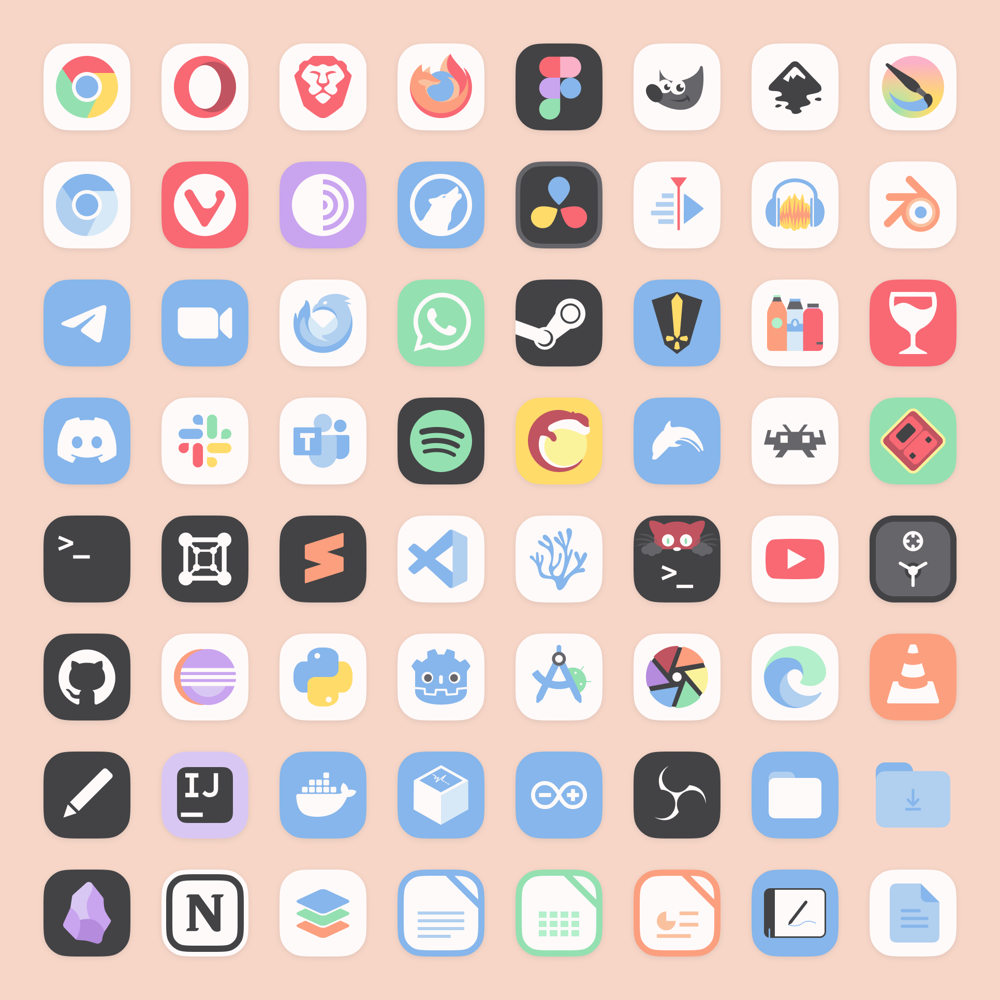

# Mignon-Pastel Icon Theme

Flat, pastel-colored icon theme that will add a lively touch to your Linux workspace. I created it because finding the perfect pastel icon theme for my computer was a struggle, so here it is to fill this void.

## Installation
1. **Clone this repository** with the command:

`git clone https://github.com/igorfmoraes/Mignon-icon-theme.git`

_You can also download the theme as a compressed file, but the `install.sh` script won't automatically perform updates since it's not in a git repository_

2. **Open a terminal in the `Mignon-icon-theme` directory.**

3. **Run the command:** `./install.sh` to install or update - That's it! Your icons will be available.

## Preview

## A Little More About Mignon Icons

I created it based on the [Tela-circle](https://github.com/vinceliuice/Tela-circle-icon-theme) icon theme by [vinceliuice](https://github.com/vinceliuice). Vince is a great designer, his themes are gorgeous, and I wouldn't even be able to do the installation script and icon linkage if not by looking at his work.

The theme has a very restricted palette, consisting of 6 main colors, 3 neutral colors, and 9 secondary colors.

## Contributing

I'd love to see fellow customization/FOSS design enthusiasts! Feel free to contribute to the Mignon-Pastel by creating icons for new applications or suggesting improvements. Thanks to everyone who sees, uses and/or create issues in this project!
