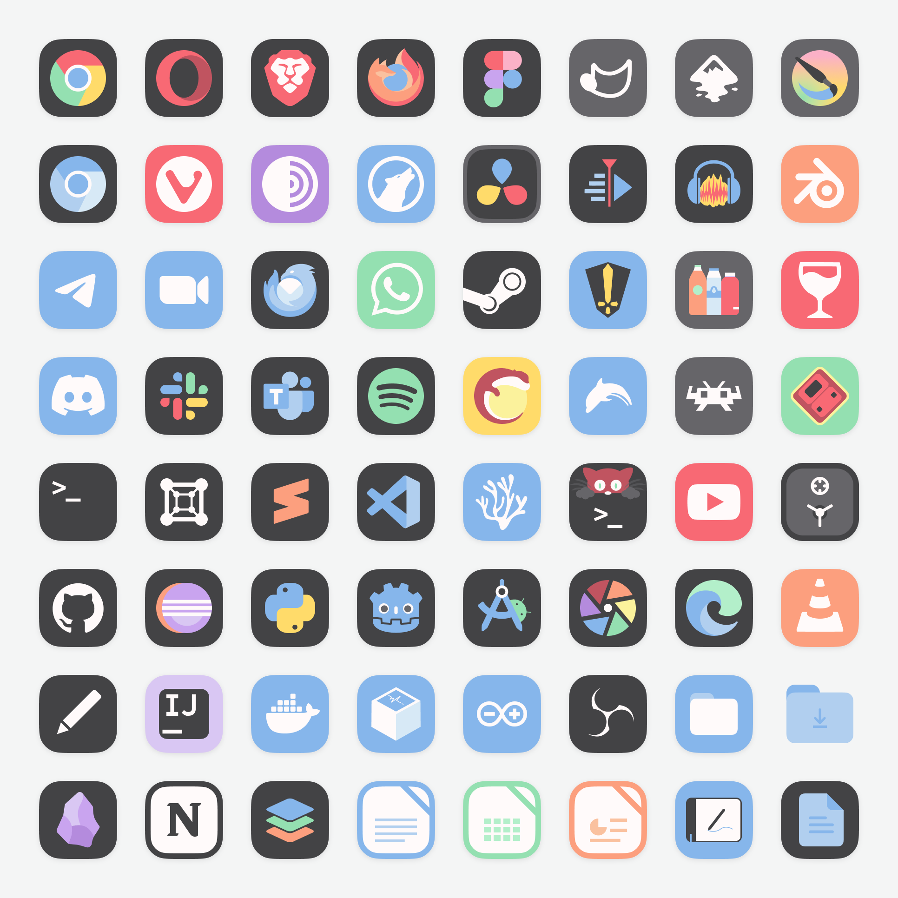
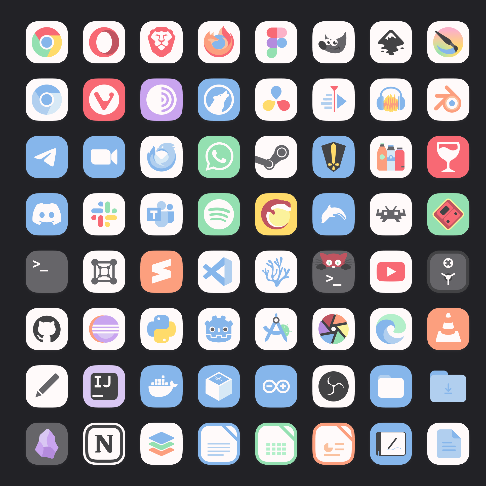

# Mignon-Pastel Icon Theme

Flat, pastel-colored icon theme for your Linux workspace.

## Installation
To enable updates via the installation script, the theme must be cloned via git. Downloading the repository as a compressed archive disables the script's update functionality.

1. **Clone the repository**:

`git clone https://github.com/igorfmoraes/Mignon-icon-theme.git`

2. **Navigate to the cloned directory:**

`cd Mignon-icon-theme`

3. **Execute the installation script**

`./install.sh`

**Installation Options**
Executing `./install.sh` without arguments installs only the base theme. Add the following flags to also install specific variants:

`-l`: Installs the Light version (excludes dark backgrounds).

`-d`: Installs the Dark version (excludes light backgrounds).

`-a`: Installs all theme versions. 

## Preview
**Base Theme**: The default version uses both white and dark bases for the icons.

**Light Version**: For light-themed desktop environments. Icon backgrounds are restricted to colors or dark gray to maintain contrast.

**Dark Version**: For dark-themed desktop environments. Icon backgrounds are restricted to colors or white to maintain contrast.

## A Little More About Mignon Icons

The structural foundation of Mignon-Pastel is based on the [Tela-circle](https://github.com/vinceliuice/Tela-circle-icon-theme) icon theme by [vinceliuice](https://github.com/vinceliuice). The installation scripts and directory linkage logic are derived directly from that repository. Vince is a great designer and I love his themes.

I created it because finding the perfect pastel icon theme for my computer was a struggle, so here it is to fill this void.

## Contributing

I invite everyone to contribute by creating icons or sending suggestions/feedback for new application icons or structural modifications. A Figma file is included in the repository, providing the color palette, icon grid, and existing variants to standardize new additions.

Thanks to everyone who sees, uses and/or create issues in this project!
